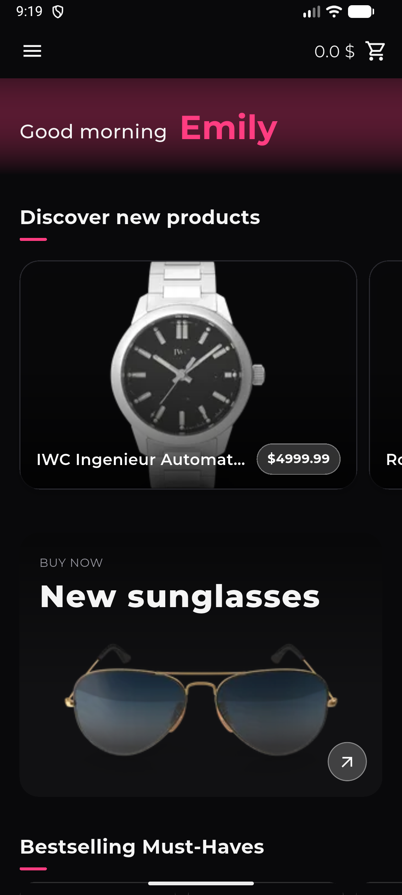
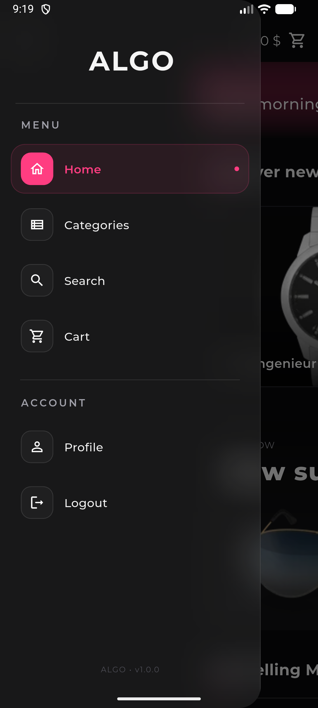
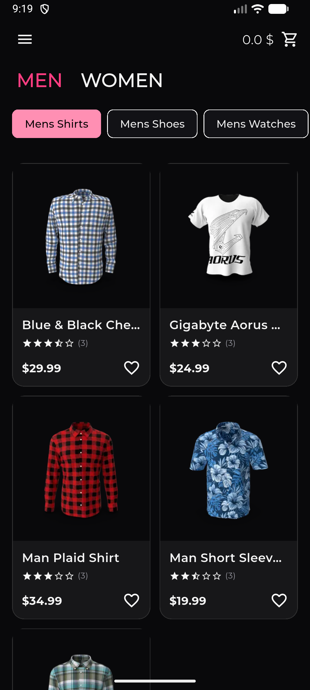
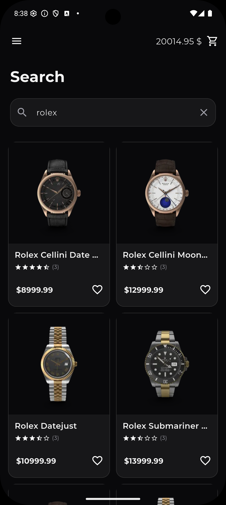
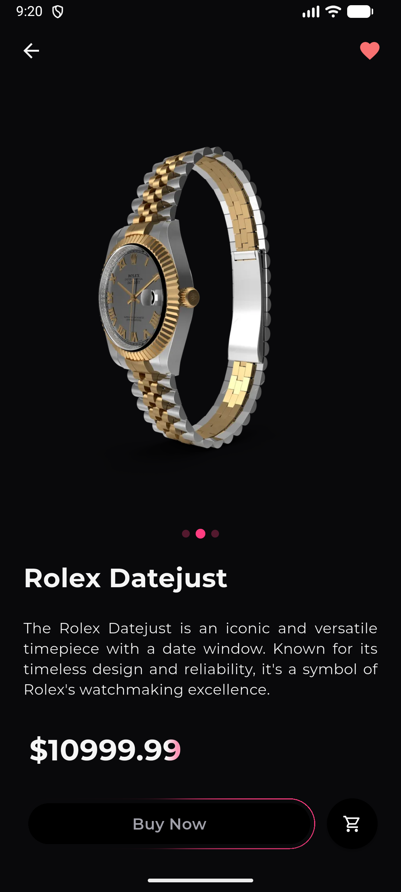
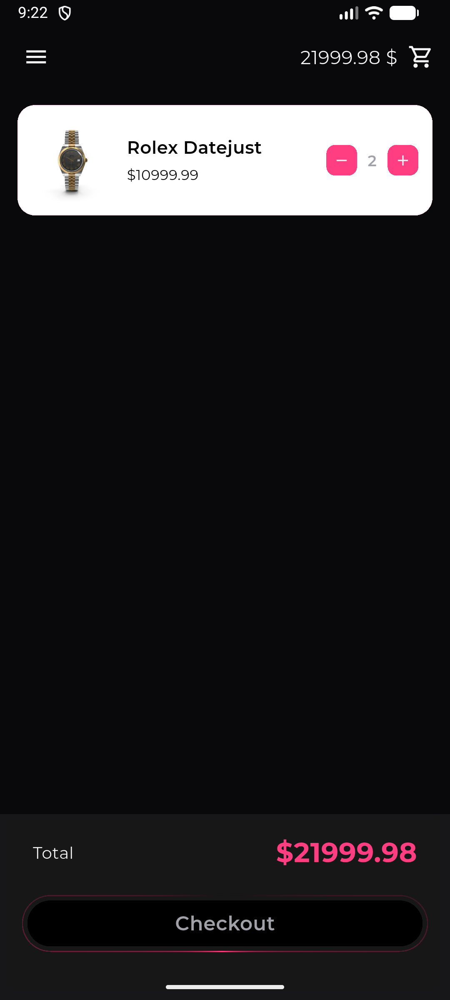
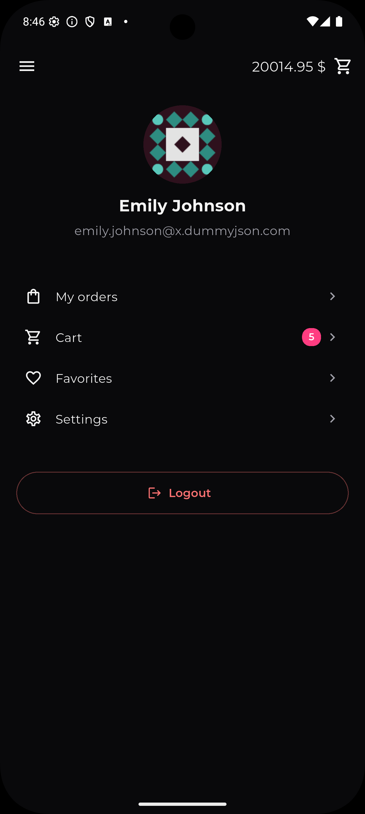
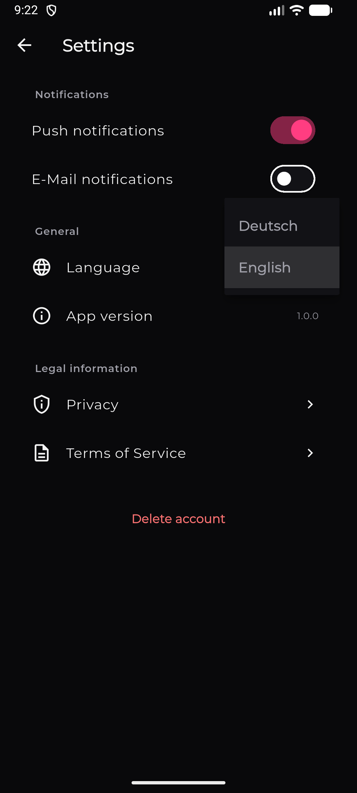
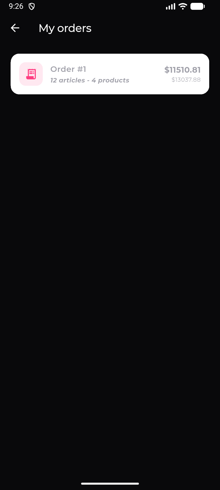
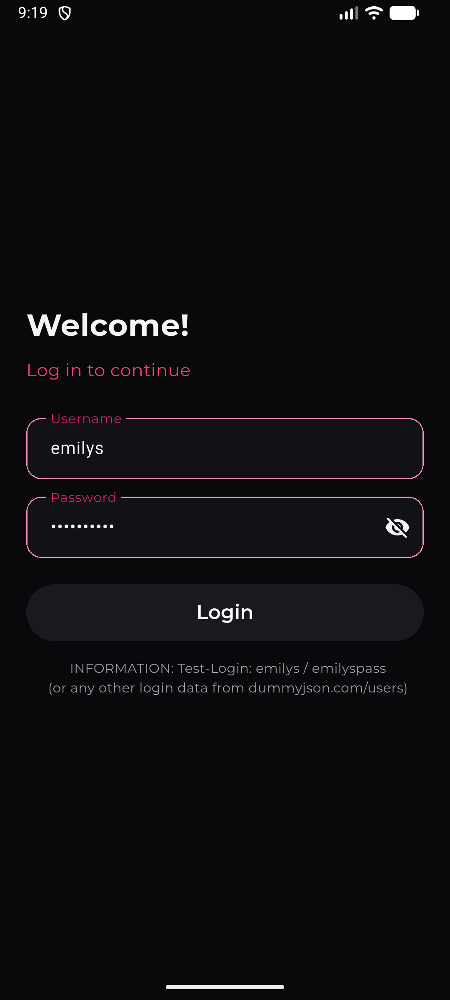

# ✦ ALGO — Flutter E-Commerce App

A modern dark-themed e-commerce application built with **Flutter and Dart**.

ALGO is a portfolio project focused on building a complete mobile shopping experience while demonstrating modern Flutter development, state management, REST API integration, reusable UI components and responsive design.

> **This is a portfolio/demo application.**  
> Products and store data are provided by a public mock API. No real purchases or payments are processed.

---

## ✨ Features

### 🛍️ Shopping

- Browse products by category
- Product search
- Product detail pages
- Product images and descriptions
- Price and product information
- Favorite products
- Shopping cart
- Buy Now flow
- Order overview
- Mock checkout experience

### 👤 Profile

- User profile screen
- Favorite products
- Order history
- Mock account settings

### ⚙️ Settings

- Mock application settings
- Mock Legal information

### 🎨 UI / UX

- Modern dark interface
- Glassmorphism-inspired UI
- Custom color system
- Reusable product cards
- Animated UI elements
- Responsive layouts
- Custom navigation drawer
- Product grids and scrollable layouts
- Google Fonts

---

## 🧰 Tech Stack

| Technology     | Usage                                |
| -------------- | ------------------------------------ |
| **Flutter**    | Cross-platform application framework |
| **Dart**       | Programming language                 |
| **Riverpod**   | State management                     |
| **REST API**   | Product data                         |
| **DummyJSON**  | Mock product API                     |
| **Material 3** | UI foundation                        |

---

## 🌐 API

Product data is provided by the free [DummyJSON](https://dummyjson.com/) REST API.

The application uses the API for:

- Product listings
- Product search
- Categories
- Individual product details
- Pagination / result limits

Example:

```http
GET /products?limit=20

Search:
GET /products/search?q=phone

Category:
GET /products/category/sunglasses
```

## State Management

Application state is handled using Riverpod.

Examples of state managed by Riverpod include:

- Product data
- Product queries
- Selected categories
- Drawer state
- Favorites
- Shopping cart
- Orders
- User-related application state

API-driven state is exposed through asynchronous providers, allowing the UI to react automatically to loading, success and error states.

## Screens

The application currently includes:

🏠 Home
🔎 Search
🗂️ Categories
🛍️ Product Details
❤️ Favorites
🛒 Cart
⚡ Buy Now
📦 Orders
👤 Profile
⚙️ Settings

## 🔍 Product Search

Products can be searched directly through the API instead of downloading the entire product catalogue and filtering it locally.

```
User
 │
 ▼
Search Screen
 │
 ▼
Product Query
 │
 ▼
REST API
 │
 ▼
Search Results
 │
 ▼
Product Cards
```

This keeps the client-side implementation lightweight and demonstrates server-side querying.

## 🚀 Getting Started

Prerequisites

Make sure you have Flutter installed:

```
flutter --version
```

Clone the repository

```
git clone https://github.com/YOUR_USERNAME/YOUR_REPOSITORY.git
```

Navigate into the project:

```
cd YOUR_REPOSITORY
```

Install dependencies:

```
flutter pub get
```

Run the application:

```
flutter run
```

## App Preview

### Home & discovery

<p align="center">
  
  
  
  
</p>

### Shopping

<p align="center">
  
  
</p>

### Profile & settings

<p align="center">
  
  
  
  
</p>
